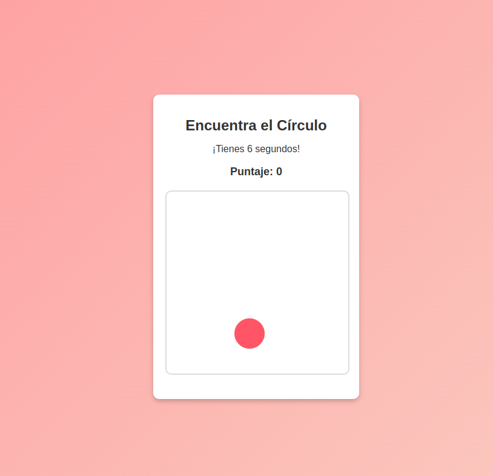

# Ejercicios Front-End

Este repositorio contiene una colección de ejercicios prácticos diseñados para aprender y practicar **HTML**, **CSS** y **JavaScript**. Cada ejercicio tiene como objetivo desarrollar componentes interactivos para mejorar la experiencia del usuario.

---

## Ejercicios

### 1. Encuentra el Círculo

**Descripción**:  
En este ejercicio debes presionar el circulo la mayor cantidad de veces hasta que se agote el tiempo.

**Vista del Ejercicio**:  

---

### 2. Galería de Imágenes

**Descripción**:  
Este ejercicio consiste en una galería interactiva que permite al usuario cambiar las imágenes de una lista y el color del fondo con botones. Es ideal para aprender la manipulación del DOM y la integración de estilos dinámicos.

**Vista del Ejercicio**:  

---
